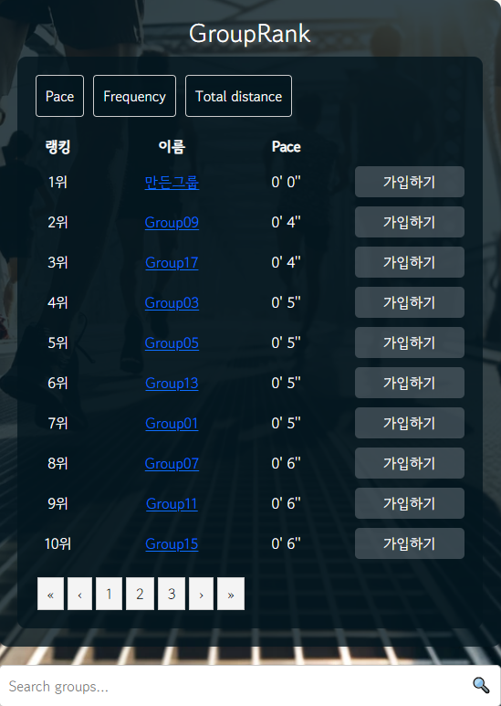
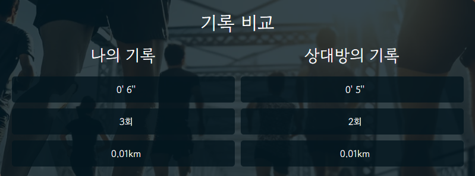

# 프로젝트 이름: Running Mate

## 1. 프로젝트 개요
- **프로젝트 설명**
  서드파티 런닝앱(스트라바)으로 기록한 런닝 데이터를 API로 받아와, 다른 사용자와 경쟁하고 비교할 수 있는 런닝 기록 비교 애플리케이션
- **주요 기능**
  - 개인 운동기록 시각화
  - 라이벌과 경쟁
  - 그룹 형성 및 커뮤니케이션
- **기술 스택**
  - 백엔드: Java, Spring, Spring Boot, MySQL
  - 프론트엔드: HTML5, CSS, JavaScript, Vue.js, Bootstrap
  - 기타: Node.js, Git, Notion

## 2. 팀원 소개

  <table>
    <tr>
      <td align="center">
        <a href="https://github.com/SACANDO">
          
           
          <strong>배수아</strong>
        </a>
      </td>
      <td>
        <ul>
          <li>팀장</li>
          <li>백엔드 파트</li>
          <li>프론트엔드 Bootstrap 적용 및 Strava API 연결</li>
          <li>MySQL</li>
        </ul>
      </td>
    </tr>
    <tr>
      <td align="center">
        <a href="https://github.com/roqdkfwk">
          
           
          <strong>유석민</strong>
        </a>
      </td>
      <td>
        <ul>
          <li>팀원</li>
          <li>프론트엔드 파트</li>
          <li>Documentation</li>
        </ul>
      </td>
    </tr>
  </table>

## 3. 개발 목표
### 3.1 개발 이유 – 타 러닝 서비스의 아쉬움
- 친구를 등록하기 위해서는 연락처를 알아야 한다.
- 다른 사용자의 기록을 살펴보는 게 직관적이지 않다.
- 나의 기록을 살펴보는 게 직관적이지 않다.

### 3.2 프로젝트 설명
- **개인 운동기록 시각화**: 서드파티 앱에서 런닝기록을 받아와 나의 런닝 현황을 그래프와 캘린더로 쉽게 파악할 수 있다.
- **라이벌과 경쟁**: 등록된 친구가 아니더라도 정보 공개를 허용한 사용자의 기록을 통해 나의 실력을 가늠하거나 동기부여가 될 수 있다.
- **그룹**: 실력, 목표 등이 비슷한 다른 사용자나 지인들과 그룹을 형성해 커뮤니케이션을 할 수 있다.

## 4. 기본 기능

### 메인 

메인 화면에서는 사용자가 로그인을 할 수 있습니다.

기본 기능들에 접근할 수 있는 Nav Bar와 주요 기능들에 접근할 수 있는 HanBurger Button이 있습니다.

### 유저 랭킹

사용자 랭킹 화면에서는 Pace, Frequency, Total Distance에 따라 사용자들의 랭킹이 정렬되어 보입니다. 

다른 유저와 기록 비교, 라이벌 등록 기능이 있고 검색하여 사용자를 찾을 수 있습니다.

### 그룹 랭킹

그룹 랭킹 화면에서는 Pace, Frequency, Total Distance에 따라 그룹의 랭킹이 정렬되어 보입니다. 

그룹 상세 페이지로 이동, 그룹에 가입하기 기능이 있고 검색하여 그룹을 찾을 수 있습니다.

### 나의 기록

나의 기록 화면에서는 나의 Pace, Distance를 그래프로 확인하거나 달린 날을 캘린더에서 확인할 수 있습니다.

### 라이벌과 비교

다른 유저와의 비교 화면에서는 다른 유저의 기록과 비교할 수 있습니다.

## 5. 상세 구현 내용

### Strava API를 이용한 런닝 기록
- Strava API로 런닝 기록을 서비스와 연동

### MyRecordView - 나의 로그
- 나의 페이스 기록을 그래프로 표시
- 내가 달린 누적 거리를 계산해 그래프로 표시
- 달력에 런닝한 날을 표시 (일, 주, 월 별로 볼 수 있음)

### MyRecordView - 최근 활동
- 최근 런닝 기록을 날짜 순으로 출력

### UserRankView - 사용자 랭킹 및 검색
- 사용자들을 페이스 순으로 정렬
- 사용자들을 달린 빈도 순으로 정렬
- 사용자들이 달린 거리의 합 순으로 정렬

### 라이벌 기능
- 다른 유저를 라이벌로 등록하여 라이벌과의 랭킹을 비교하는 기능

### GroupRankView – 그룹 랭킹 및 검색
- 그룹을 페이스 순으로 정렬
- 그룹을 달린 빈도 순으로 정렬
- 그룹을 달린 거리의 합 순으로 정렬

### 그룹 상세 페이지
- 그룹에 속한 사용자들을 랭킹 순으로 출력
- 그룹 멤버들끼리 다양한 정보를 주고받을 수 있는 게시판 기능

### 게시판
- 게시글 목록
- 게시글 작성
- 게시글 수정
- 게시글 상세
- 댓글 기능

### HomeView Nav Bar Hamburger Button
- 이동할 페이지로 메뉴를 보여주는 HamburgerButton
- 메인 화면으로 이동할 수 있는 버튼인 상단바 Running Mate
- 로그인 & 로그아웃 버튼과 그룹 생성
- Strava에서 데이터를 가져오는 기능을 가진 버튼

### 회원가입 및 로그인
- 로그인 기능
- 회원가입 기능

